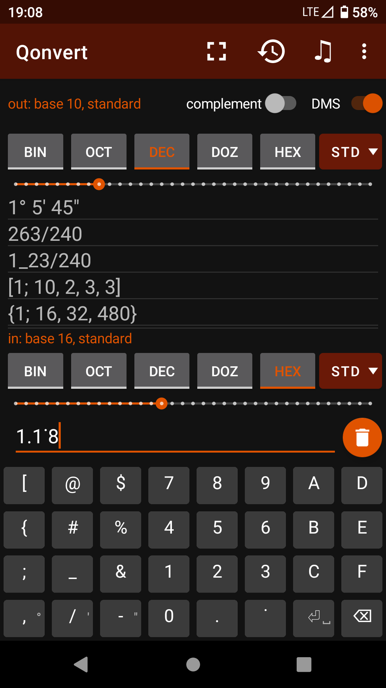
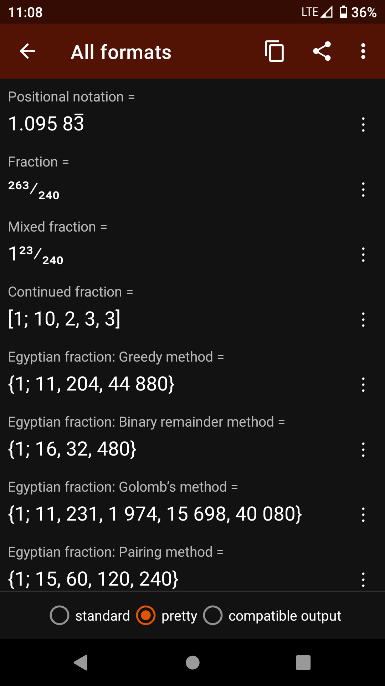
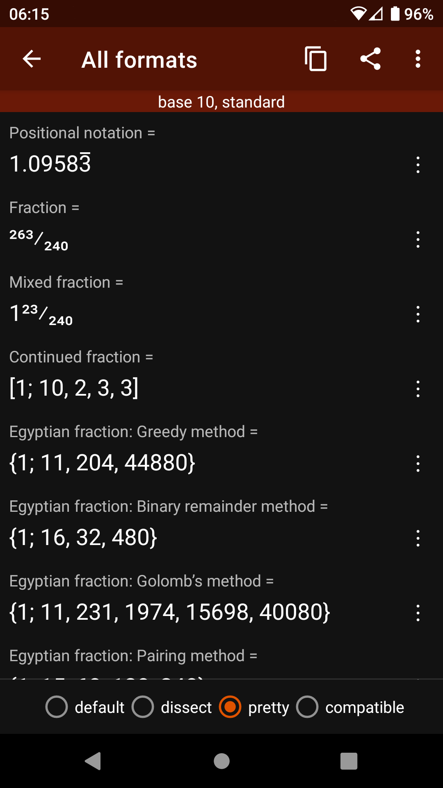
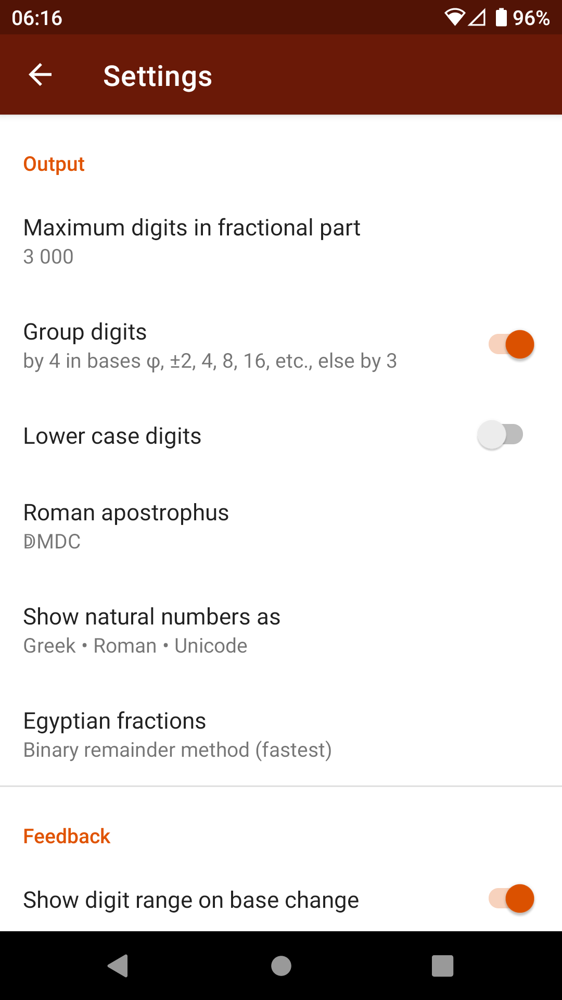
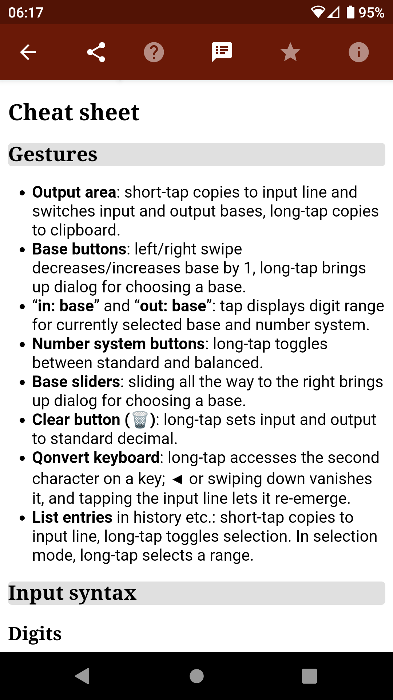
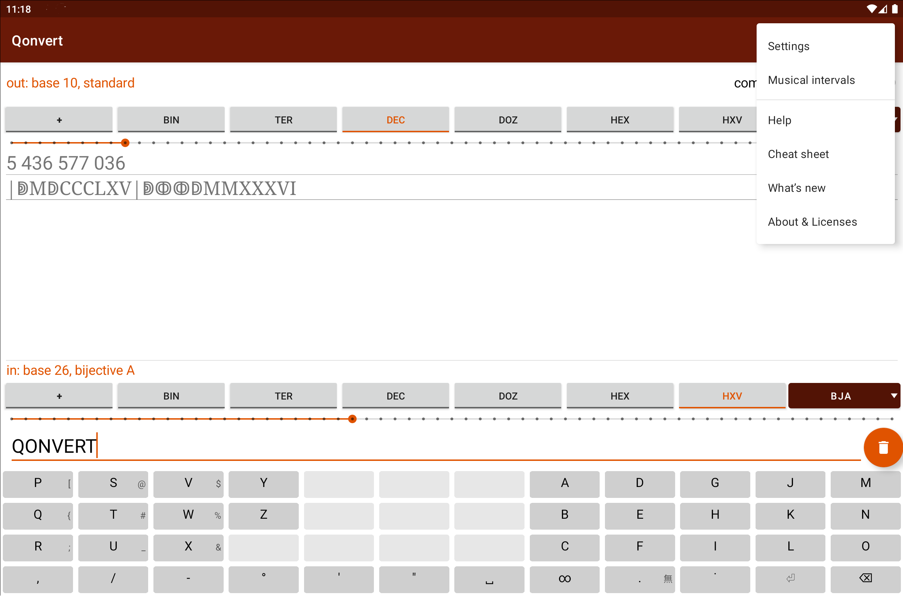

# Qonvert
Qonvert is an Android app available on [Google Play](https://play.google.com/store/apps/details?id=org.tessoft.qonvert), [F-Droid](https://f-droid.org/packages/org.tessoft.qonvert/) and [Uptodown](https://qonvert.en.uptodown.com/android). It is free, contains no ads, collects or shares no personal data, and needs no special permissions.

* Practically unlimited size and precision
* Converting between bases 2 to 100, negative 2 to 100, and the golden ratio base
* Converting rational numbers between positional notation (including repeating digits) and fractions (including mixed, improper, continued and Egyptian fractions)
* Converting between minus (-3) and complement notation (FFFFFFFD)
* Converting to and from degrees, minutes and seconds
* Balanced numeral systems such as balanced ternary
* Bijective numeration
* Greek (Milesian) numerals
* Roman numerals including unciae (twelfths)
* Unicode characters
* Playing musical intervals with a given frequency ratio
* Highly customizable, including light and dark colour schemes

➤ See the app’s **[help pages](https://lemizh.conlang.org/home/qonvert.php)** for more information (also **[in German](https://lemizh.conlang.org/home/qonvert.php?lang=de)**).

      
