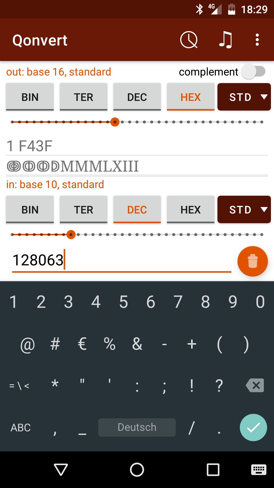
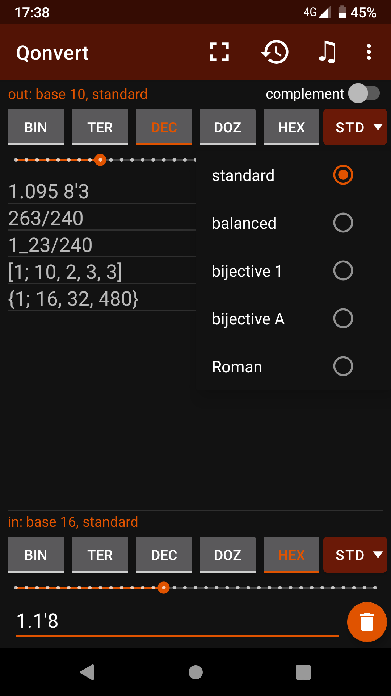
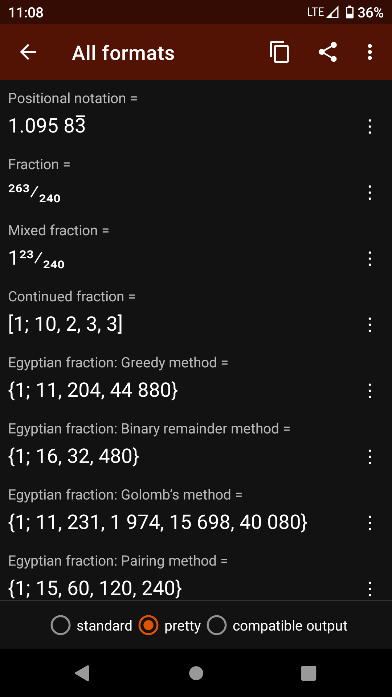
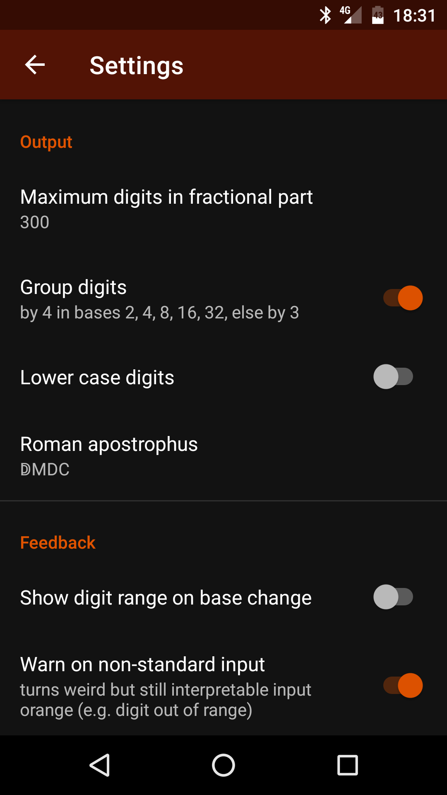
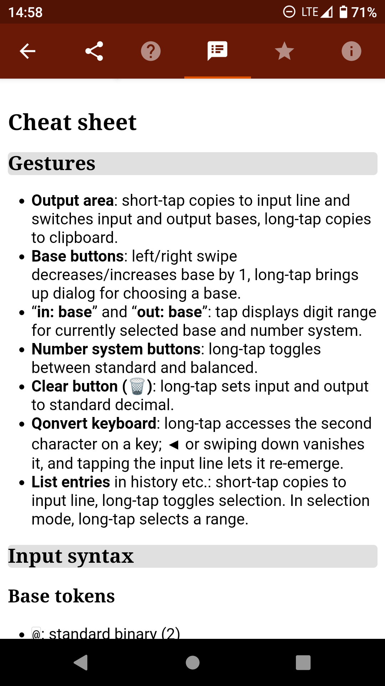

# Qonvert
Qonvert is available on <a href="https://play.google.com/store/apps/details?id=org.tessoft.qonvert">Google Play</a> and <a href="https://qonvert.en.uptodown.com/android">Uptodown</a>. It is free, contains no ads, collects or shares no personal data, and needs no special permissions.

* Practically unlimited size and precision
* Converting between bases 2 to 36
* Converting rational numbers between positional notation (including repeating digits) and fractions (including improper, mixed, continued and Egyptian fractions)
* Converting between minus (-2) and complement notation (FFFFFFFE)
* Balanced numeral systems such as balanced ternary
* Bijective numeration
* Roman numerals including unciae (twelfths)
* Plus: Output of Greek numbers, Unicode characters – and it plays musical intervals with a given frequency ratio!
* Light and dark colour schemes

    
